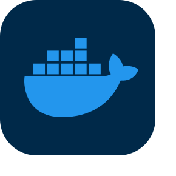
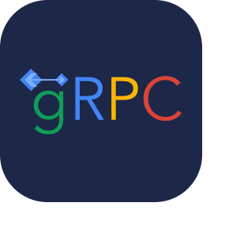
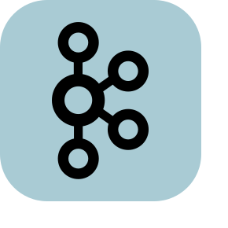

# I'm Ivan Vasilevsky

### About

I've always enjoyed bringing ideas to life, and programming became the medium through which I found the perfect way to realize this passion.
&nbsp;

### Tech Stack

  
  
  
  
  
  
  
  
  
  
  
  
  
  

### Contacts

  
  
  

